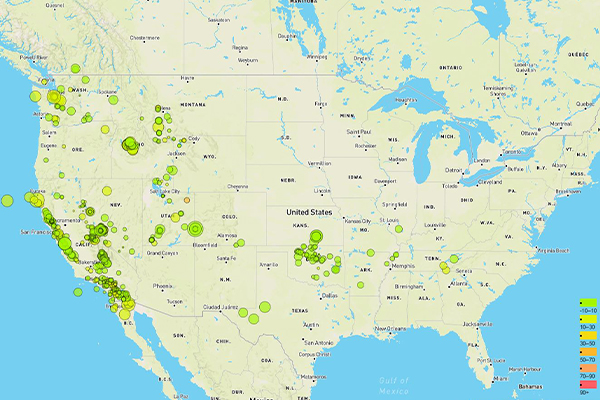

# Visualizing USGS Data with Leaflet

This project involves building tools to visualize earthquake data from the USGS (United States Geological Survey).  A JSON data set for "All Earthquakes from the Past 7 Days" is displayed on a map using Leaflet.  The USGS GeoJSON Feed page contains this and other datasets:

https://earthquake.usgs.gov/earthquakes/feed/v1.0/geojson.php

The data markers reflect the magnitude of the earthquake by their size and depth of the earthquake by color.  Earthquakes with higher magnitudes appear larger and earthquakes with greater depth appear darker in color.  The map includes popups that provide additional information about the earthquake when a marker is clicked.  Full-sized image can be found in the folder:

        Leaflet/static/images/basicmap_screenshot.JPG